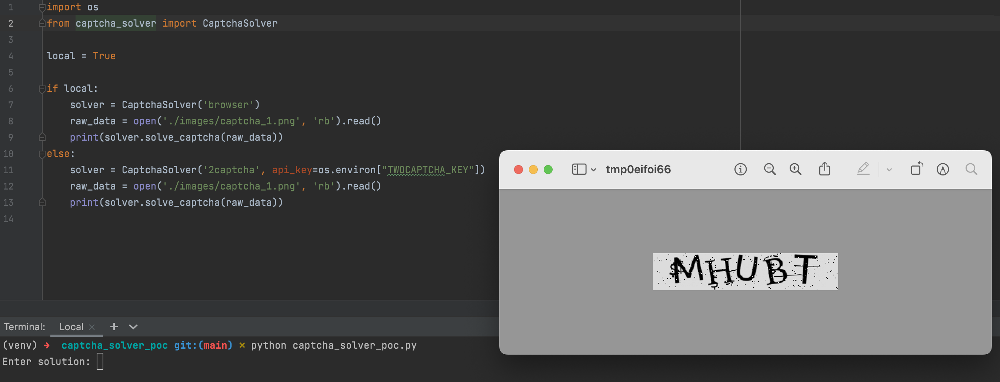
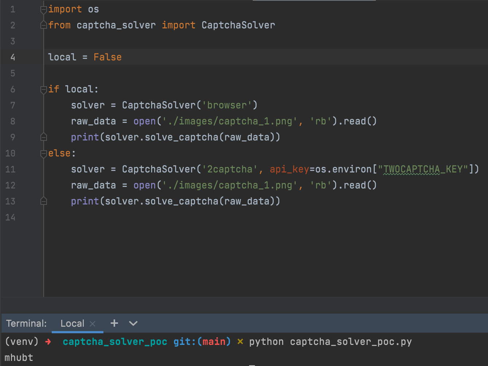

# CAPTCHA Solver POC

Be Aware this script is consuming a 3rd party service provided by [2captcha](https://2captcha.com/), which in essential is a platform that uses real people to solve captchas.

In this POC, two approaches have been tested:

* Asking the user that is executing the script to solve the captcha
```py
local = True
```

* Using 2Captcha service, which will require your 2captcha API KEY
```shell
export TWOCAPTCHA_KEY='my_secret_key'
```
```py
local = False
```
